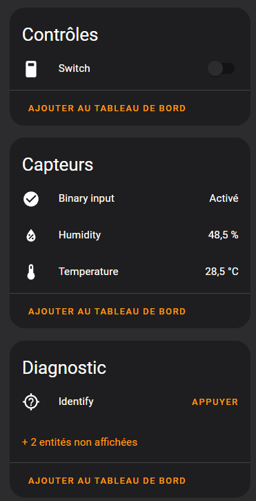

# ESP32-H2 Demo Zigbee Device

This project is a demo Zigbee device based on the ESP32-H2 / ESP32-C6

## Features

- [x] DHT22 temperature and humidity sensor
- [x] Binary switch
- [x] Binary input

## Hardware

- [ESP32-H2](https://www.espressif.com/en/products/socs/h2/overview)

## GPIO

| GPIO   | Function              |
| ------ | --------------------- |
| GPIO8  | DHT22 data            |
| GPIO0  | Binary output (LED)   |
| GPIO12 | Binary input (Button) |
